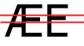

# Biko
* Source: [DaFont](http://www.dafont.com/biko.font)
* Use: *Free for personal use*
* Format: otf
* Version: Regular, black, bold and light. [**Note**: *The **light** version is restricted to upper-case.*]

##Versions

##Example 
This example uses the **bold** version for the title and the **regular** for the rest.

##Details
The Biko is a strict font that does not have any extra decorations.
Every stroke have the same width.

### Heights

Upper case letters with "details" in the middle part of the letter are "lifted" so the letters are divided in thirds. One third above the *red* line - and 2 thirds below.

* BEFGHPWXY

However letters

* A and M are using the *blue* line as rest. (Also applies to X to some extent). They would look funny if they used the *red* line.

* Q is the odd man here - but it is a perfect circle, and this brings the center point into play

Lower case letters are using the 2/3 height of the upper case letters.

The use of fixed stroke width and strict design makes the "reuse" of letterforms easier - but also gives a harmonic and symmetric feel.

Various letter forms do overlap:

* P -> BR
* C -> GOQ
* F -> E
* c -> adegoq + flipped in bp

Others are flipped / rotated
* b -> dpq

However a letter like W is **NOT** a simpel combination of two V. The angles are different (when compared to the base).

An interesting detail is the M is only slightly wider than N.

Nor is the 'triangle' in MWXY exact the same.

Other potential reuses are u->hmn and l->bdhk

#Exception
The Æ (AE ligature) does not use the normal E but rather an E with a lower middle stroke. It must because of the middle stroke in the A are lower - and visual it would look better this way.

