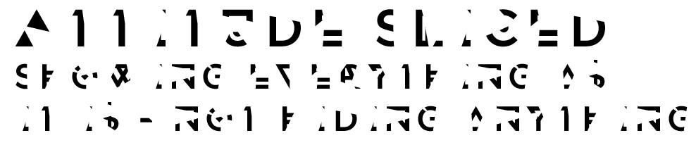
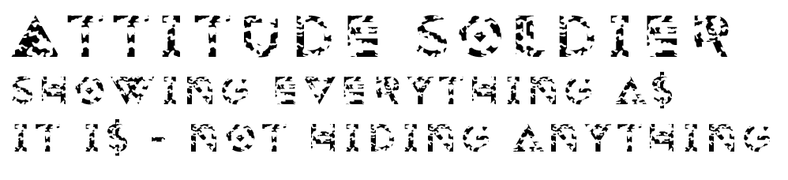
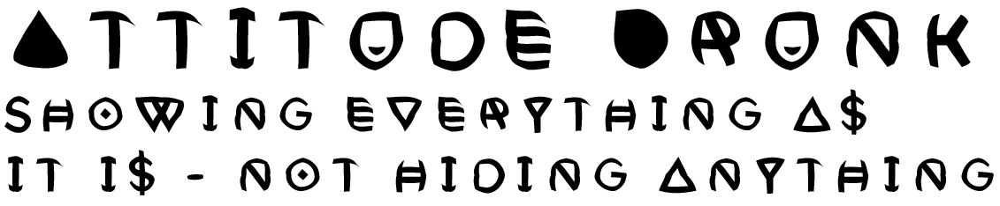
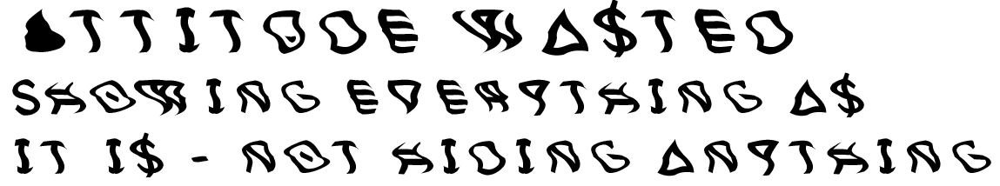
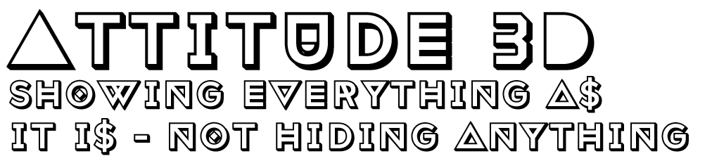
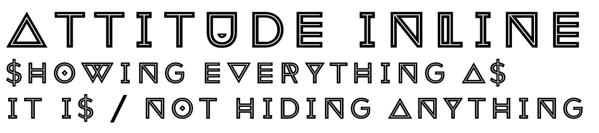
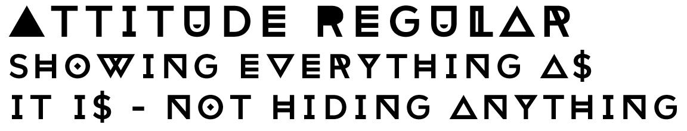

#Attitude
**Disclaimer**: *This is not completely free - but requires a twitter or facebook post.*

Found at [Emil Kozole' page](https://www.behance.net/gallery/Attitude-font/6822285)

* Format: OTF
* Versions: Regular, inline, 3d, sliced, soldier, drunk and wasted.
* Styles: Regular and alternate 

This is a font that is best used for posters.

The versions **sliced**, **soldier**, **drunk** and **wasted** can be ignored. The letters are already hard to read
and making them more obscure does no good.

* **Sliced** 

* **Soldier** 

* **Drunk** 

* **Wasted** 

However I could imaging using e.g. sliced on top of a regular using different colors:

The 

* **3D** 

* **Inline** 

* **Regular** 

are more or less readable - and can produce some magic for short sentences.

##Problem in Windows 10
The many versions and styles does not play well with Windows and its programs.
Often you can only see one of these versions - and it seems to be random.
I suggest you only install one of these versions - in this case the '**regular**' version.

It could work better in e.g. Photoshop - however I have not been able to test it.
In my OLD PSE-8 it only shows 2 versions - and it uses the same regardsless of changing the style.